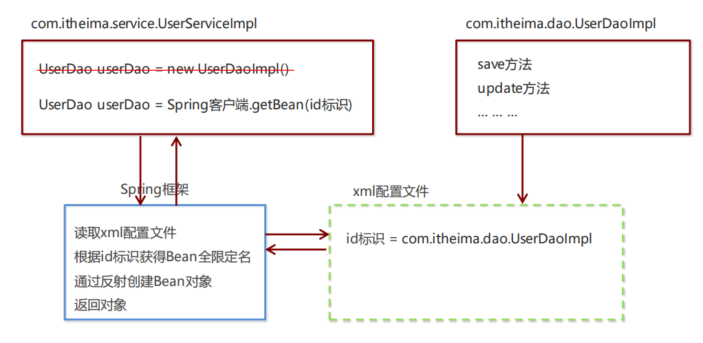
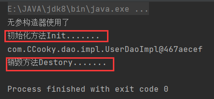

# Spring

## 1. 简介

### 概述

Spring是分层的 Java SE/EE应用 full-stack 轻量级开源框架，以 **IoC**（Inverse Of Control：反转控制）和**AOP**（Aspect Oriented Programming：面向切面编程）为内核。

提供了**表现层 SpringMVC** 和**持久层 Spring JDBCTemplate** 以及**业务层事务管理**等众多的企业级应用技术，还能整合开源世界众多著名的第三方框架和类库，逐渐成为使用最多的Java EE 企业应用开源框架。

回顾一下MVC与三层架构：


可见，Spring是业务逻辑层的框架。

### 优势

**1）方便解耦，简化开发**

通过 Spring 提供的 IoC容器，可以将对象间的依赖关系交由 Spring 进行控制，避免硬编码所造成的过度耦合。

用户也不必再为单例模式类、属性文件解析等这些很底层的需求编写代码，可以更专注于上层的应用。

**2）AOP 编程的支持**

通过 Spring的 AOP 功能，方便进行面向切面编程，许多不容易用传统 OOP 实现的功能可以通过 AOP 轻松实现。

**3）声明式事务的支持**

可以将我们从单调烦闷的事务管理代码中解脱出来，通过声明式方式灵活的进行事务管理，提高开发效率和质量。

**4）方便程序的测试**

可以用非容器依赖的编程方式进行几乎所有的测试工作，测试不再是昂贵的操作，而是随手可做的事情。

**5）方便集成各种优秀框架**

Spring对各种优秀框架（Struts、Hibernate、Hessian、Quartz等）的支持。

**6）降低 JavaEE API 的使用难度**

Spring对 JavaEE API（如 JDBC、JavaMail、远程调用等）进行了薄薄的封装层，使这些 API 的使用难度大为降低。

**7）Java 源码是经典学习范例**

Spring的源代码设计精妙、结构清晰、匠心独用，处处体现着大师对Java 设计模式灵活运用以及对 Java技术的高深造诣。它的源代码无意是 Java 技术的最佳实践的范例。

### 体系结构


其中SpEl（Spring Expression Language，spring的EL表达式语言）没有接触过，前面的JSP是涉及到了EL表达式的，只是我们没有学而已。

## 2. 快速入门

**Spring程序开发步骤**

① 导入 Spring 开发的基本包坐标

② 编写 Dao 接口和实现类

③ 创建 Spring 核心配置文件

④ 在 Spring 配置文件中配置 UserDaoImpl

⑤ 使用 Spring 的 API 获得 Bean 实例



IDEA具体实现：

1. 创建好web模块

2. Pom.xml文件添加Spring的依赖

   ```xml
     <dependency>
       <groupId>org.springframework</groupId>
       <artifactId>spring-context</artifactId>
       <version>5.3.14</version>
     </dependency>
   ```

3. 在resources下创建Spring的核心配置文件——applicationContext.xml


这样按照模块创建的，他自己就已经带有xml的格式限制等。

4. 编写Dao接口和实现类

```java
public interface UserDao {
		public void save();
}

public class UserDaoImpl implements UserDao {
		@Override
		public void save() {
				System.out.println("UserDao save method running....");
		} 
}
```

5. 在核心配置文件中配置UserDao的实现类**UserDaoImpl**。

   这样最后通过反射得到的对象就是这个实现类。

```xml
<?xml version="1.0" encoding="UTF-8"?>
<beans xmlns="http://www.springframework.org/schema/beans"
       xmlns:xsi="http://www.w3.org/2001/XMLSchema-instance"
      xsi:schemaLocation="http://www.springframework.org/schema/beans http://www.springframework.org/schema/beans/spring-beans.xsd">
    
  
    <bean id="userDao" class="com.CCooky.dao.impl.UserDaoImpl"></bean>
</beans>
```

6. Test测试

```java
    @Test
    public void test1(){
      // 加载Spring应用
        ApplicationContext app = new ClassPathXmlApplicationContext("applicationContext.xml");
     //这里反射出来的应该是Impl实现类，所以这一行代码用到了强制类型转换和多态
        UserDao userDao = (UserDao) app.getBean("userDao");
        userDao.save();
    }
```

==总结==

从这里可以看出，我们以后的Service层与dao层就完全解耦了，当dao层的实现类发生改变时，只需要动一下配置文件就行了，service完全不用动。

## 3. Spring配置文件

### Bean

用于配置对象交由**Spring** 来创建。

默认情况下它调用的是类中的**无参构造函数**，如果没有无参构造函数则不能创建成功。

基本属性：

-  **id**：Bean实例在Spring容器中的唯一标识
- **class**：Bean的全限定名称

#### **Bean标签范围配置**

| scope**取值范围** | **说明**                                                     |
| ----------------- | ------------------------------------------------------------ |
| **singleton**     | **默认值，单例的**，就是说容器里面一直只有唯一一个对象       |
| **prototype**     | **多例的**，容器里面可以创建多个对象，每次使用创建一个新的   |
| request           | WEB 项目中，Spring 创建一个 Bean 的对象，将对象存入到 request 域中 |
| session           | WEB 项目中，Spring 创建一个 Bean 的对象，将对象存入到 session 域中 |
| global  session   | WEB 项目中，应用在 Portlet 环境，如果没有 Portlet 环境那么globalSession 相当 |

**1）当scope的取值为singleton时**

Bean的实例化个数：1个

Bean的实例化时机：当Spring核心文件被加载时，实例化配置的Bean实例

Bean的生命周期：

- 对象创建：当加载应用，创建容器时，对象被创建
-  对象运行：只要容器在，对象一直活着
- 对象销毁：当应用卸载，销毁容器时，对象就被销毁了

**2）当scope的取值为prototype时**

Bean的实例化个数：多个

Bean的实例化时机：当调用getBean( )方法时实例化Bean

-  对象创建：当使用对象时getBean()，对象被创建
-  对象运行：只要对象在使用中，就一直活着
-  对象销毁：当对象长时间不用时，被 Java 的垃圾回收器回收了

```xml
<bean id="userDao" class="com.CCooky.dao.impl.UserDaoImpl" scope="singleton"></bean>
```

```java
@Test
// 测试scope属性
public void test1(){
    ApplicationContext app = new ClassPathXmlApplicationContext("applicationContext.xml");
    //这里反射出来的应该是Impl实现类，所以这一行代码用到了强制类型转换和多态
    UserDao userDao = (UserDao) app.getBean("userDao");
    UserDao userDao2 = (UserDao) app.getBean("userDao");
    System.out.println(userDao);
    System.out.println(userDao2);
}
```

#### **Bean生命周期配置**

-  **init-method**：手动可指定类中的自己写的初始化方法名称，在对象创建后Spring会自动调用指定的方法，目的是完成一些必要的初始化工作
-  **destroy-method**：手动可指定类中自己销毁方法名称，在销毁对象前，Spring会自动调用指定的方法，目的是完成一些销毁前的工作

Example：

实现类

```java
public class UserDaoImpl implements UserDao {
    public UserDaoImpl() {
        System.out.println("无参构造器使用了");
    }

    public void init(){
        System.out.println("初始化方法Init.......");
    }
    public void destory(){
        System.out.println("Destory.......");
    }

    @Override
    public void save() {
        System.out.println("save is running.......");
    }
}
```

applicationContext.xml

```java
<bean id="userDao" class="com.CCooky.dao.impl.UserDaoImpl" scope="singleton" init-method="init" destroy-method="destory"></bean>
```

Test

```java
    @Test
    public void test1(){
        ClassPathXmlApplicationContext app = new ClassPathXmlApplicationContext("applicationContext.xml");
        //这里反射出来的应该是Impl实现类，所以这一行代码用到了强制类型转换和多态
        UserDao userDao = (UserDao) app.getBean("userDao");
        System.out.println(userDao);
        app.close();
    }
```



#### **Bean实例化三种方式**

- 无参**构造**方法实例化（默认）
- 工厂**静态**方法实例化
- 工厂**实例**方法实例化

==**无参构造方法实例化**==

就是前面入门用的这种，而且基本上大部分都是用这种，方便快捷。

```xml
<bean id="userDao" class="com.itheima.dao.impl.UserDaoImpl"/>
```

==**工厂静态方法实例化**==

新建一个工厂对象，里面写一个静态方法，然后在配置文件更改。没有什么很特别的，就是看着好像高级一点


```xml
<bean id="userDao" class="com.CCooky.factory.StaticFactory" factory-method="getUserDao"></bean>
```

其他的测试部分都不用动撒，完全感觉到了方便哦，解耦了！！！！

==**工厂实例方法实例化**==

这个和上一个静态方法几乎一样，方法内容什么的全部不用动，但多麻烦一步，因为是实例方法，所以需要通过实例对象才可以调用，不能直接类名＋方法名。


注意：第一个bean是声明了我们动态工厂类的对象，第二个标签是factory-bean，拿到实例对象，调用方法。

#### **Bean的依赖注入入门**

前面我们写了DAO层的东西，并且在Spring里面配置了。然后下一步就是写Service层的内容，需要调用DAO层的方法；实现完业务层后，就是Cotroller层，调用Service内方法，在这里我们也是需要new Service对象的，好接下来：

下面我们先按照无注入的情况下，和前面写Dao对象的方式一样！！！

① 创建 UserService，UserService内部也写一个save方法，里面调用 UserDao的save() 方法

```java
public class UserServiceImpl implements UserService {
    @Override
    public void save() {
        ApplicationContext app = new ClassPathXmlApplicationContext("applicationContext.xml");
        UserDao userDao = (UserDao) app.getBean("userDao");
        userDao.save();
    }
}
```

② 将 UserServiceImpl 的创建权交给 Spring

```xml
<bean id="userService" class="com.CCooky.service.impl.UserServiceImpl"></bean>
```

③Controller层里面 从 Spring 容器中获得 UserService 进行操作

```java
public class UserController {
    public static void main(String[] args) {
        ApplicationContext app = new ClassPathXmlApplicationContext("applicationContext.xml");
        UserService userService = (UserService) app.getBean("userService");
        userService.save();
    }
}
```

开始运行，是没有问题。


我们分析一下整个实现流程：目前UserService实例和UserDao实例都存在与Spring容器中，当前的做法是在容器外部获得UserService实例和UserDao实例，然后在程序中进行结合。


这种方式是不是显得有笨笨的呢！！！因为里面有重复代码，我们new了两个app出来，而且最终程序直接使用的只有UserService啊，所以说：我们应该在Spring容器里面，将将UserDao设置到UserService内部！！！

因为UserService和UserDao都在Spring容器中，而最终程序直接使用的是UserService，所以可以在Spring容器中，将UserDao设置到UserService内部。


##### **依赖注入概念**

**依赖注入（Dependency Injection）：它是 Spring 框架核心 IOC 的具体实现。**

在编写程序时，通过控制反转，把对象的创建交给了 Spring，但是代码中不可能出现没有依赖的情况。IOC 解耦只是降低他们的依赖关系，但不会消除。例如：业务层仍会调用持久层的方法。

那这种业务层和持久层的依赖关系，在使用 Spring 之后，就让 Spring 来维护了。简单的说，就是坐等框架把持久层对象传入业务层，而不用我们自己去获取。

##### **依赖注入方式**

怎么将UserDao怎样注入到UserService内部呢？

-  **构造方法**

-  **set方法**

==**set方法注入**==

这个很简单，就是在UserServiceImpl中添加添加一个成员变量，写上setUserDao方法。然后在save方法里面直接调用该变量的方法, 之前的加载应用，调用getBean获取userDao对象的代码全部不要了

```java
public class UserServiceImpl implements UserService {
  // 添加一个成员变量
    private UserDao userDao;
    public void setUserDao(UserDao userDao) {
        this.userDao = userDao;
    }
    @Override
    public void save() {
    /*ApplicationContext app = new ClassPathXmlApplicationContext("applicationContext.xml");
        UserDao userDao = (UserDao) app.getBean("userDao");
    */
        userDao.save();
    }
}
```

配置Spring容器调用set方法进行注入, **bean的Property标签**

==注意哦：<property name="userDao" ref="userDao"/>，这个里面的name是指的你要调用的set方法，因为Spring知道你是set注入，所以不用写set，直接写setUserDao的后面字符。小驼峰格式；==

==ref代表引用，是指的被注入的对象，前面我们已经把userDao对象放到了Spring容器里面，id为userDao，所以这里写userDao==


```xml
<bean id="userDao" class="com.itheima.dao.impl.UserDaoImpl"/>

<bean id="userService" class="com.itheima.service.impl.UserServiceImpl"> 
  	<property name="userDao" ref="userDao"/>
</bean>
```

这样，在Spring容器里面，UserDao就被设置到UserService内部！！！


运行Controller的测试：

```java
public class UserController {
    public static void main(String[] args) {
        ApplicationContext app = new ClassPathXmlApplicationContext("applicationContext.xml");
        UserService userService = (UserService) app.getBean("userService");
        userService.save();
    }
}
```

OK！！！可以成功调用运行。==注意哦，这都是从Spring容器里面拿的对象哦，单独自己去new可不行==

==**P命名空间注入**==

入本质也是set方法注入，但比起上述的set方法注入更加方便，主要体现在配置文件中，如下：首先，需要引入P命名空间：

```xml
xmlns:p="http://www.springframework.org/schema/p"
```

其次，需要修改注入方式

```xml
<bean id="userService" class="com.itheima.service.impl.UserServiceImpl" p:userDao-ref="userDao"/>
```

其他的不用动

==**构造方法注入**==

和前面的set差不多嘛，都是添加一个成员变量，只是说用的是有参构造器注入参数，还是set来设置而已。

```java
public class UserServiceImpl implements UserService {
    private UserDao userDao;

    public UserServiceImpl(UserDao userDao) {
        this.userDao = userDao;
    }

    @Override
    public void save() {
        userDao.save();
    }
}
```

在核心配置文件，配置constructor-arg标签

==注意哦：<constructor-arg name="userDao" ref="userDao"></constructor-arg>，里面第一个name是指的构造器的参数，就是那个被注入的成员变量userDao；==

==ref代表引用，是指的被注入的对象，前面我们已经把userDao对象放到了Spring容器里面，id为userDao，所以这里写userDao==

```xml
<bean id="userService" class="com.CCooky.service.impl.UserServiceImpl">
    <constructor-arg name="userDao" ref="userDao"></constructor-arg>
</bean>
```

#### **依赖注入的数据类型**

注入数据的三种数据类型

-  **普通数据类型**
-  **引用数据类型**
-  **集合数据类型**

其中引用数据类型，此处就不再赘述了，之前的操作都是对UserDao对象的引用进行注入的，下面将以set方法注入为例，演示普通数据类型和集合数据类型的注入。

==**普通数据类型**==

```java
public class UserDaoImpl implements UserDao {
    private String username;
    private int age;

    public void setUsername(String username) {
        this.username = username;
    }

    public void setAge(int age) {
        this.age = age;
    }

    @Override
    public void save() {
        System.out.println("save is running.......");
        System.out.println(username);
        System.out.println(age);
    }
}
```

```xml
<bean id="userDao" class="com.CCooky.dao.impl.UserDaoImpl">
    <property name="username" value="周权"></property>
    <property name="age" value="22"></property>
</bean>

<bean id="userService" class="com.CCooky.service.impl.UserServiceImpl">
    <property name="userDao" ref="userDao"></property>
</bean>
```

==**集合数据类型**==

```java
public class UserDaoImpl implements UserDao {
		private List<String> strList;
  
		public void setStrList(List<String> strList) {
				this.strList = strList;
		}
    @Override
		public void save() {
				System.out.println(strList);
				System.out.println("UserDao save method running....");
		} 
}
```

```xml
<bean id="userDao" class="com.CCooky.dao.impl.UserDaoImpl">
    <property name="strList">
        <list>
            <value>aaa</value>
            <value>ccc</value>
            <value>bbb</value>
        </list>
    </property>
</bean>
```

还有其他的就不看了，以后springboot也不需要写这些，但要知道原理

### **引入其他配置文件（分模块开发）**

从上面一个很简单的例子可以看出，spring核心配置文件要写的东西真的很多！！！这就导致Spring配置很繁杂且体积很大，所以，==可以将部分配置拆解到其他配置文件中，而在Spring主配置文件通过import标签进行加载==

```xml
<import resource="applicationContext-xxx.xml"/>
```

意思就是：我可以把Dao层的写在一个applicationContext-dao.xml里面，把service层的写在applicationContext-service.xml里面，可以把我用户模块的写在applicationContext-user.xml里面等等！！最后在主配置文件里面全部引入，统一到一起。

## 4. Spring相关API

###  **ApplicationContext的继承体系**

**applicationContext：**接口类型，代表**应用上下文对象**，可以通过其实例获得 Spring 容器中的 Bean 对象。

紫色：接口；	浅绿色：抽象类；	深绿色：实现类


**ApplicationContext的实现类**

**1）ClassPathXmlApplicationContext**

​		它是从类的根路径下加载配置文件（放在resources下） 推荐使用这种

**2）FileSystemXmlApplicationContext**

​		它是从磁盘路径上加载配置文件，配置文件可以在磁盘的任意位置。

**3）AnnotationConfigApplicationContext**

​		当使用注解配置容器对象时，需要使用此类来创建 spring 容器。它用来读取注解。

### **getBean()方法使用**

```java
// 一、根据bean的id找
public Object getBean(String name) throws BeansException {
		assertBeanFactoryActive();
		return getBeanFactory().getBean(name);
}
// 二、根据字节码对象类型找（不用这个）
public <T> T getBean(Class<T> requiredType) throws BeansException {
		assertBeanFactoryActive();
		return getBeanFactory().getBean(requiredType);
}
```

其中，当参数的数据类型是字符串时，表示根据Bean的id从容器中获得Bean实例，返回是Object，需要强转。

当参数的数据类型是Class类型时，表示根据类型从容器中匹配Bean实例，当容器中相同类型的Bean有多个时，则此方法会报错。

## **5. Spring配置数据源**

**数据源（连接池）的作用**

- 数据源(连接池)是提高程序性能出现的
- 事先实例化数据源，初始化部分连接资源
- 使用连接资源时从数据源中获取
- 使用完毕后将连接资源归还给数据源

常见的数据源(连接池)：**DBCP、C3P0、BoneCP、Druid**等

**数据源的开发步骤**

① 导入数据源的坐标和数据库驱动坐标

② 创建数据源对象

③ 设置数据源的基本连接数据。

④ 使用数据源获取连接资源和归还连接资源

### **数据源的手动创建**

我们以Druid为例：首先导入druid和mysql驱动jar包。然后用一个测试方法去创建数据源，这只是一个范例啊

```java
@Test
public void testDruid() throws Exception {
	//创建数据源
		DruidDataSource dataSource = new DruidDataSource();
	//设置数据库连接参数
		dataSource.setDriverClassName("com.mysql.jdbc.Driver");
		dataSource.setUrl("jdbc:mysql://localhost:3306/test");
		dataSource.setUsername("root");
		dataSource.setPassword("root");
	//获得连接对象
		Connection connection = dataSource.getConnection();
		System.out.println(connection);
}
```

这里的连接参数很烦，如果还需要配置多个数据源，都这样写就会引起问题；当数据库连接信息发生变化时，需要改很多东西，耦合性太高了。所以我们这里单独写一个配置文件properties存放连接信息，创建数据池时，先从这个里面读取.

在resources下新建一个jdbc.properties配置文件

```properties
jdbc.driver=com.mysql.jdbc.Driver
jdbc.url=jdbc:mysql://localhost:3306/test
jdbc.username=root
jdbc.password=root
```


读取jdbc.properties配置文件创建连接池

```java
    @Test
    public void testDruid() throws Exception {
        //加载类路径下的jdbc.properties.专门对properties读取所以不需要后缀
        ResourceBundle rb = ResourceBundle.getBundle("jdbc");
        //创建数据源
        DruidDataSource dataSource = new DruidDataSource();
        //设置数据库连接参数
        dataSource.setDriverClassName(rb.getString("jdbc.driver"));
        dataSource.setUrl(rb.getString("jdbc.url"));
        dataSource.setUsername(rb.getString("jdbc.userName"));
        dataSource.setPassword(rb.getString("jdbc.passWord"));
        Connection connection = dataSource.getConnection();
        System.out.println(connection);
    }
}
```

### **Spring配置数据源（引入Context）**

可以将DataSource的创建权交由Spring容器去完成，原因如下：

- 首先DataSource有无参构造方法，而Spring默认就是通过无参构造方法实例化对象的
- 其次DataSource要想使用需要通过set方法设置数据库连接信息，而Spring可以通过set方法进行字符串注入

```xml
<bean id="dataSource" class="com.alibaba.druid.pool.DruidDataSource">
    <property name="driverClassName" value="com.mysql.jdbc.Driver"></property>
    <property name="url" value="jdbc:mysql://localhost:3306/studysql?useSSL=false"></property>
    <property name="username" value="root"></property>
    <property name="password" value="5240zhouquan"></property>
</bean>
```

```java
@Test
public void testDruid() throws Exception {
    ApplicationContext app = new 		ClassPathXmlApplicationContext("applicationContext.xml");
    DataSource dataSource = (DataSource) app.getBean("dataSource");
    Connection connection = dataSource.getConnection();
    System.out.println(connection);
}
```

获取一个类的全限定名的快速方法，双击选中右键


==**优化优化**==

上面通过Spring配置数据源的办法有没有实现数据库与连接信息解耦呢？？？答案是有，已经解耦了，因为当数据库发生变化时，我们只需要修改配置文件就行了，不用更改源码（这是判断是否解耦的一个标准）。

但是java开发一直有一个规范，就是习惯把什么东西的配置分开放，Spring的配置信息全部放在Spring配置文件；数据库连接信息全部放在另外一个jdbc的配置文件。分区存放，以后维护特别方便！！！

所以我们单独新建一个jdbc.properties配置文件存放数据库连接信息，然后实现在applicationContext.xml文件中读取jdbc.properties里面的信息。

**步骤：**

==jdbc.properties：==

```properties
jdbc.driver=com.mysql.jdbc.Driver
jdbc.url=jdbc:mysql://localhost:3306/test
jdbc.username=root
jdbc.password=root
```

==applicationContext.xml==

如果需要加载jdbc.properties配置文件获得连接信息。首先，需要引入context命名空间和约束路径：

命名空间：

```xml
xmlns:context="http://www.springframework.org/schema/context"
```

约束路径：

```xml
http://www.springframework.org/schema/context
http://www.springframework.org/schema/context/spring-context.xsd
```

```xml
// 加载外部的properties文件
<context:property-placeholder location="classpath:jdbc.properties"/>
// 使用SpEL表达式读取容器内的信息
<bean id="dataSource" class="com.mchange.v2.c3p0.ComboPooledDataSource">   		<property name="driverClassName" value="${jdbc.driver}"></property>
	 <property name="url" value="${jdbc.url}"></property>
	 <property name="username" value="${jdbc.username}"></property>
	 <property name="password" value="${jdbc.password}"></property>
</bean>
```

## 6. Spring注解开发

Spring是轻代码而重配置的框架，配置比较繁重，影响开发效率，所以注解开发是一种趋势，注解代替xml配置文件可以简化配置，提高开发效率。

### **Spring原始注解**

Spring原始注解主要是替代<Bean>的配置

| **注解**    | **说明**                                                     |
| ----------- | ------------------------------------------------------------ |
| @Component  | 使用在类上用于实例化Bean                                     |
| @Controller | 使用在web层类上用于实例化Bean(同Component，但具有语义的作用) |
| @Service    | 使用在service层类上用于实例化Bean(同Component，但具有语义的作用) |
| @Repository | 使用在dao层类上用于实例化Bean(同Component，但具有语义的作用) |
| @Autowired  | 使用在字段上按照数据类型从Spring容器中进行依赖注入（等同于getBean里面字节码对象类型注入，可能有问题） |
| @Qualifier  | 结合@Autowired一起使用，根据bean名称进行依赖注入             |
| @Resource   | 相当于@Autowired+@Qualifier，按照bean名称进行注入            |
| @Value      | 注入普通属性   <property value>标签                          |
| @Scope      | 标注Bean的作用范围                                           |

| **注解**       | **说明**                                                 |
| -------------- | -------------------------------------------------------- |
| @PostConstruct | 使用在方法上标注该方法是Bean的初始化方法（init-method）  |
| @PreDestroy    | 使用在方法上标注该方法是Bean的销毁方法（destroy-method） |

**@Component** 

​	可以加bean-id，也可以不加bean-id。不加的话，注入就只能根据字节码对象类型注入。

```java
@Component("userDao")

@Component
```

**@Autowired** 

​	当使用这个注解进行注入时，不用再写set方法，具体他是使用的什么办法进行注入的呢，这里暂时没有讲。一般与@Qualifier 一起用根据bean-id进行注入，比较专业

```java
    @Autowired
    private UserDao userDao;

    @Autowired
    @Qualifier("userDao")
    private UserDao userDao;
```

**@Value**

使用很简单。直接在成员变量上加这个注解，同时可以结合SpEL使用，舒舒服服。

```java
    @Value("周权")
    private String name;

    @Value("${jdbc.driver}")
    private String driver;
```

#### **入门案例**

用注解的方式简化我们的快速入门demo（使用了依赖注入的）。环境很简单，就是一个dao，一个service，一个模拟的controller，其中dao在容器里面被注入到service。

==applicationContext.xml==

引入context了。

```xml
<?xml version="1.0" encoding="UTF-8"?>
<beans xmlns="http://www.springframework.org/schema/beans"
       xmlns:context="http://www.springframework.org/schema/context"
       xmlns:xsi="http://www.w3.org/2001/XMLSchema-instance"
       xsi:schemaLocation="http://www.springframework.org/schema/beans
       http://www.springframework.org/schema/beans/spring-beans.xsd
       http://www.springframework.org/schema/context
       http://www.springframework.org/schema/context/spring-context.xsd">
			
  		//dataSource
      <context:property-placeholder location="classpath:jdbc.properties"></context:property-placeholder>
    <bean id="dataSource" class="com.alibaba.druid.pool.DruidDataSource">
        <property name="driverClassName" value="${jdbc.driver}"></property>
        <property name="url" value="${jdbc.url}"></property>
        <property name="username" value="${jdbc.username}"></property>
        <property name="password" value="${jdbc.password}"></property>
    </bean>
  		// Dao
		  <bean id="userDao" class="com.CCooky.dao.impl.UserDaoImpl"></bean>
  		// Service
  		<bean id="userService" class="com.CCooky.service.impl.UserServiceImpl">
  				<property name="userDao" ref="userDao"></property>
  		</bean>
			// 配置组件扫描
    	<context:component-scan base-package="com.CCooky"></context:component-scan>
</beans>
```

现在直接将这两个bean去掉，改成注解。

**Dao层**

最好用@Repository

```java
//<bean id="userDao" class="com.CCooky.dao.impl.UserDaoImpl"></bean>

@Component("userDao")	// 括号里面= bean-id
public class UserDaoImpl implements UserDao {

    @Override
    public void save() {
        System.out.println("save is running.......");
    }
}
```

**Service层**

最好使用@Service 

```java
//<bean id="userService" class="com.CCooky.service.impl.UserServiceImpl">
//</bean>

@Component("userService")// bean-id
public class UserServiceImpl implements UserService {
  
    @Value("周权")
    private String name;

    @Value("${jdbc.driver}")
    private String driver;
  
    //<property name="userDao" ref="userDao"></property>
  
    @Autowired
    @Qualifier("userDao")// 括号里面=ref；两个结合，根据bean-id注入对象
    private UserDao userDao;

    @Override
    public void save() {
        userDao.save();
    }
}
```

**组件扫描**

你自己配置好了，但是Spring不晓得的哇，你要去告诉Spring，我代码哪些部分已经配置了注解，需要在applicationContext.xml中配置组件扫描，配置一个包的范围，这样Spring就会自动去这个包以及子包下所有的注解。

```xml
<!--注解的组件扫描--> 
<context:component-scan base-package="com.CCooky"></context:component-scan>
```

**测试**

这里没有真的写web层，只是在测试一下，写了个main。

```java
public class UserController {
    public static void main(String[] args) {
        ApplicationContext app = new ClassPathXmlApplicationContext("applicationContext.xml");
        UserService userService = (UserService) app.getBean("userService");
        userService.save();
    }
}
```

###  **Spring新注解**

使用上面的注解还不能全部替代xml配置文件，例如我们上面案例中的数据源配置、组件扫描配置等，其他的需要使用注解替代的xml标签如下：

-  非自定义的Bean的配置：< bean>
-  加载properties文件的配置：<context:property-placeholder >
-  组件扫描的配置：<context:component-scan >
-  引入其他文件：< import>

| **注解**        | **说明**                                                     |
| --------------- | ------------------------------------------------------------ |
| @Configuration  | 标志该类是Spring的核心配置类！                               |
| @ComponentScan  | 用于指定 Spring 在初始化容器时要扫描的包。作用和在 Spring 的 xml 配置文件中的<context:component-scan   base-package="com.CCooky"/>一样 |
| @Bean           | 使用在方法上，标注将该方法的返回值存储到 Spring 容器中       |
| @PropertySource | 用于加载.properties 文件中的配置                             |
| @Import         | 用于导入其他配置类，导入的是数组哦                           |

```xml
@ComponentScan("com.CCooky")

@Bean("dataSource")// Spring会将当前方法的返回值以指定名称bean-id存储到容器里面
public DataSource getDataSource(){
			......
}

@PropertySource("classpath:jdbc.properties")// 用于加载.properties文件中的配置

@Import({DataSourceConfiguration.class}) //加载子配置类到主配置类，导入的是数组哦
```

#### 案例

接着上面的案例，把下面的三个注释的内容用注解替代！！！并且把这个xml配置文件也可以删掉了哦，哈哈哈哈哈，完全注解开发！！

```xml
<?xml version="1.0" encoding="UTF-8"?>
<beans xmlns="http://www.springframework.org/schema/beans"
       xmlns:context="http://www.springframework.org/schema/context"
       xmlns:xsi="http://www.w3.org/2001/XMLSchema-instance"
       xsi:schemaLocation="http://www.springframework.org/schema/beans
       http://www.springframework.org/schema/beans/spring-beans.xsd
       http://www.springframework.org/schema/context
       http://www.springframework.org/schema/context/spring-context.xsd">
<!--加载properties文件-->
    <context:property-placeholder location="classpath:jdbc.properties"></context:property-placeholder>
<!--dataSource-->
    <bean id="dataSource" class="com.alibaba.druid.pool.DruidDataSource">
        <property name="driverClassName" value="${jdbc.driver}"></property>
        <property name="url" value="${jdbc.url}"></property>
        <property name="username" value="${jdbc.username}"></property>
        <property name="password" value="${jdbc.password}"></property>
    </bean>
<!--配置组件扫描-->
    <context:component-scan base-package="com.CCooky"></context:component-scan>
</beans>
```

第一步：新建核心配置类


```java
// 标志该类是Spring的核心配置类
@Configuration

//<context:component-scan base-package="com.CCooky"></context:component-scan>
@ComponentScan("com.CCooky")

//<import resource="applicationContext-xxx.xml"/>
@Import({DataSourceConfiguration.class}) //加载子配置类到主配置类，导入的是数组哦

public class SpringConfiguration {
    
}
```

第二步：新建数据源的配置类，用来加载jdbc.properties里面的信息，并且创建DataSource对象，放到容器里面。

```java
//<context:property-placeholder location="classpath:jdbc.properties"></context:property-placeholder>
@PropertySource("classpath:jdbc.properties")

public class DataSourceConfiguration {
    @Value("${jdbc.driver}")
    private String driver;
    @Value("${jdbc.url}")
    private String url;
    @Value("${jdbc.username}")
    private String username;
    @Value("${jdbc.password}")
    private String password;

    @Bean("dataSource")
 	 //Spring会将当前方法的返回值以指定名称bean-id存储到容器里面
    public DataSource getDataSource(){
        //创建数据源
        DruidDataSource dataSource = new DruidDataSource();
        //设置数据库连接参数
        dataSource.setDriverClassName(driver);
        dataSource.setUrl(url);
        dataSource.setUsername(username);
        dataSource.setPassword(password);
        return dataSource;
    }
}
```

第三步：测试类，这里创建app上下文应用时，要换一个实现类。前面都是用的类路径xml加载的实现类，现在要用注解配置的实现类。

```java
new ClassPathXmlApplicationContext("applicationContext.xml")
```

```java
new AnnotationConfigApplicationContext(SpringConfiguration.class)
```

```java
@Test
public void testConfiguration(){
    ApplicationContext app = new AnnotationConfigApplicationContext(SpringConfiguration.class);
    UserService userService = (UserService) app.getBean("userService");
    userService.save();
}
```

## 7. Spring整合Junit

 **原始Junit测试Spring的问题**

前面是Junit框架和Spring框架单独的两部分，并没有把他们合在一起,只是在一起使用这两个东西。

你看，在测试类中，每个测试方法都有以下两行代码：很麻烦！不喜欢！


这两行代码的作用是获取容器，如果不写的话，直接会提示空指针异常。所以又不能轻易删掉。

**上述问题解决思路**

- ==让SpringJunit负责创建Spring容器==，但是需要将配置文件的名称告诉它
- 将需要进行测试Bean直接在测试类中进行注入

**Spring集成Junit步骤**

① 导入spring集成Junit的jar包的坐标

② 使用@Runwith注解替换原来的运行期

③ 使用@ContextConfiguration指定配置文件或配置类

④ 使用@Autowired注入需要测试的对象

⑤ 创建测试方法进行测试

一：导入spring集成Junit的jar包的坐标

```xml
<!--此处需要注意的是，spring5 及以上版本要求 junit 的版本必须是 4.12 及以上--> 
<dependency> 
   <groupId>org.springframework</groupId> 
   <artifactId>spring-test</artifactId> 		 
   <version>5.0.2.RELEASE</version>
</dependency> 
<dependency> 
   <groupId>junit</groupId> 
   <artifactId>junit</artifactId> 
   <version>4.12</version> 
   <scope>test</scope>
</dependency>
```

二：使用@Runwith注解替换原来的运行期。使用Spring的内核去跑，内部会帮我们做很多事情

```java
@RunWith(SpringJUnit4ClassRunner.class)
public class SpringJunitTest {
  ......
}
```

三：使用@ContextConfiguration指定配置文件或配置类，数组方式

 ```java
 @RunWith(SpringJUnit4ClassRunner.class)
 //加载spring核心配置文件
 //@ContextConfiguration(value = {"classpath:applicationContext.xml"})
 //加载spring核心配置类
 @ContextConfiguration(classes = {SpringConfiguration.class})
 public class SpringJunitTest {
   .......
 }
 ```

四：使用@Autowired注入需要测试的对象。

```java
@RunWith(SpringJUnit4ClassRunner.class)
@ContextConfiguration(classes = {SpringConfiguration.class})
public class SpringJunitTest {
  
		@Autowired
		private UserService userService; 
}
```

五：创建测试方法进行测试

```java
@RunWith(SpringJUnit4ClassRunner.class)
@ContextConfiguration(classes = {SpringConfiguration.class})
public class SpringJunitTest {
  
		@Autowired
		private UserService userService;
		@Test
		public void testUserService(){
        userService.save();
		} 
}
```

==可见，这里就不一样了，可以直接从容器里面拿需要的对象数据等等，相当于jUnit在Spring内部在运行，Spring帮我们做好一个脚手架的感觉，很方便。==

## 8. Spring与Web环境集成

首先，我们先试试加上web层是否ok。在前面的基础上，即上一个demo；用注解进行配置，然后有简单的Dao层、Service层；现在加上web层（目前使用前面学的servlet），导入servlet和tomcat依赖。

```xml
    <dependency>
      <groupId>javax.servlet</groupId>
      <artifactId>javax.servlet-api</artifactId>
      <version>3.1.0</version>
      <scope>provided</scope>
    </dependency>
```

```java
@WebServlet("/userServlet")
public class UserServlet extends HttpServlet {
    @Override
    protected void doGet(HttpServletRequest req, HttpServletResponse resp) throws ServletException, IOException {
        ApplicationContext app = new AnnotationConfigApplicationContext(SpringConfiguration.class);
        UserService userService = (UserService) app.getBean("userService");
        userService.save();
    }
}
```

用get请求访问，是ok的。

### 问题

最大的一个问题就是应用上下文对象的获取。是通过**new ClasspathXmlApplicationContext(spring配置文件)** 方式获取的，但是每次从容器中获得Bean时都要编写**new ClasspathXmlApplicationContext(spring配置文件)** ，这样的弊端是配置文件加载多次，应用上下文对象创建多次，因为我们会有多个Servlet；而这样做毫无意义。

最好的做法，就是我们启动Web服务时，仅仅创建一个app对象，然后谁用到了，谁就去拿这个对象去使用。

==具体做法分析：==在Web项目中，可以使用**ServletContextListener**监听Web应用的启动，我们可以在Web应用启动时，就加载Spring的配置文件，创建应用上下文对象**ApplicationContext**，在将其存储到最大的域**servletContext**域中，这样就可以在任意位置从域中获得应用上下文**ApplicationContext**对象了。

### Spring解决

上面的分析不用手动实现，Spring提供了一个监听器**ContextLoaderListener**就是对上述功能的封装，该监听器内部加载Spring配置文件，创建应用上下文对象，并存储到**ServletContext**域中，最后提供了一个客户端工具**WebApplicationContextUtils**供使用者获得应用上下文对象。哇哇哇哇，太舒服了哦（其实手写也不难，但就是写的麻烦）。

所以我们需要做的只有两件事：

① 在**web.xml**中配置**ContextLoaderListener**监听器（先导入spring-web坐标）

② 使用**WebApplicationContextUtils**获得应用上下文对象**ApplicationContext** 

