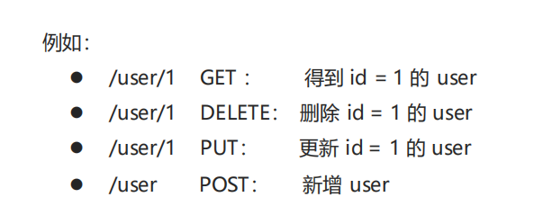
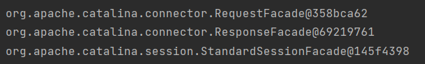

# 通用配置文件

1. 核心配置文件——**spring-mvc.xml**

   ```xml
   <?xml version="1.0" encoding="UTF-8"?>
   <beans xmlns="http://www.springframework.org/schema/beans"
          xmlns:xsi="http://www.w3.org/2001/XMLSchema-instance"
          xmlns:context="http://www.springframework.org/schema/context"
          xmlns:mvc="http://www.springframework.org/schema/mvc"
          xsi:schemaLocation="http://www.springframework.org/schema/beans
          http://www.springframework.org/schema/beans/spring-beans.xsd
          http://www.springframework.org/schema/context
          http://www.springframework.org/schema/context/spring-context.xsd
           http://www.springframework.org/schema/mvc
          http://www.springframework.org/schema/mvc/spring-mvc.xsd">
     
   <!--		组件扫描controller-->
       <context:component-scan base-package="com.CCooky.controller"/>
   <!--		配置mvc注解驱动-->
       <mvc:annotation-driven></mvc:annotation-driven>
   <!--    内部资源视图解析器-->
       <bean id="resourceViewResolver" class="org.springframework.web.servlet.view.InternalResourceViewResolver">
           <property name="prefix" value="/WEB-INF/pages/"></property>
           <property name="suffix" value=".jsp"></property>
       </bean>
   <!--    开放静态资源的访问权限-->
       <mvc:default-servlet-handler></mvc:default-servlet-handler>
   </beans>
   ```

2. 前端控制器——**web.xml**

   ```xml
   <!--Springmvc 前端控制器-->
       <servlet>
           <servlet-name>DispatcherServlet</servlet-name>
           <servlet-class>org.springframework.web.servlet.DispatcherServlet</servlet-class>
           <init-param>
               <param-name>contextConfigLocation</param-name>
               <param-value>classpath:spring-mvc.xml</param-value>
           </init-param>
         	<!--服务器启动同时启动前端控制器-->
           <load-on-startup>1</load-on-startup>
       </servlet>
       <servlet-mapping>
           <servlet-name>DispatcherServlet</servlet-name>
         	<!--这是判断该访问资源是否进入我的前端控制器（这样就是任何访问资源-->
           <url-pattern>/</url-pattern>
       </servlet-mapping>
   <!--    springMVC请求数据乱码过滤器-->
       <filter>
           <filter-name>CharacterEncodingFilter</filter-name>
           <filter-class>org.springframework.web.filter.CharacterEncodingFilter</filter-class>
           <init-param>
               <param-name>encoding</param-name>
               <param-value>UTF-8</param-value>
           </init-param>
       </filter>
       <filter-mapping>
           <filter-name>CharacterEncodingFilter</filter-name>
           <url-pattern>/*</url-pattern>
       </filter-mapping>
   ```

   

# **SpringMVC**

## 1. 概述

**SpringMVC** 是一种基于 Java 的实现 **MVC 设计模型**的请求驱动类型的轻量级 **Web 框架**，属于**SpringFrameWork** 的后续产品，已经融合在 Spring Web Flow 中。

SpringMVC 已经成为目前最主流的MVC框架之一，并且随着Spring3.0 的发布，全面超越 Struts2，成为最优秀的 MVC 框架。

==它通过一套注解，让一个简单的 Java 类成为处理请求的控制器，而无须实现任何接口==。同时它还支持 **RESTful** 编程风格的请求。


先回归一下，前面的Web知识，客户端服务端请求响应的逻辑：

- 每个Servlet都有一些共有行为，也就是一般情况下都要执行的。如先接收求参数，封装实体，访问业务层，接收返回结果，指派视图这几个。所以我们就考虑是不是可以把这些共有的行为抽取出来呢？


- 下面我们以2个Servlet为例，分析一下，把共有行为抽取出来，这样不就很好了嘛。


- 而前面的共有行为肯定不是我们自己写撒，这是由框架来提供的，并且这个共有行为部分框架被称为**前端控制器**（这也是SpringMVC的核心），这里就实现了前面提到的所有共有行为，还需要加入的其他的特殊行为就是通过我们的POJO（JavaBean）来自己实现


## 2. 快速入门

需求：客户端发起请求，服务器端接收请求，执行逻辑并进行视图跳转。

​	**注意：SpringMVC与Spring是分开独立的两个东西**

开发步骤：

① 导入SpringMVC相关坐标

② 配置SpringMVC核心控制器DispathcerServlet

③ 创建Controller类（图中的POJO）和视图页面

④ 使用注解配置Controller类中业务方法的映射地址

⑤ 配置SpringMVC核心文件 spring-mvc.xml（实现组件扫描功能）。和Spring的配置文件是分开独立的。

⑥ 客户端发起请求测试


**第一步： 导入SpringMVC相关坐标**

```xml
<!--    SpringMVC-->
    <dependency>
      <groupId>org.springframework</groupId>
      <artifactId>spring-webmvc</artifactId>
      <version>5.3.14</version>
    </dependency>
<!--    Servlet-->
    <dependency>
          <groupId>javax.servlet</groupId>
          <artifactId>servlet-api</artifactId>
          <version>2.5</version>
          <scope>provided</scope>
    </dependency>
<!--    JSP-->
    <dependency>
      <groupId>javax.servlet.jsp</groupId>
      <artifactId>jsp-api</artifactId>
        <version>2.2</version>
        <scope>provided</scope>
    </dependency>
```

**第二步： 在web.xml配置SpringMVC的核心控制器DispathcerServlet**

```xml
<!--配置SpringMVC的前端控制器-->
<servlet>
    <servlet-name>DispatcherServlet</servlet-name>
    <servlet-class>org.springframework.web.servlet.DispatcherServlet</servlet-class>
    <init-param>
        <param-name>contextConfigLocation</param-name>
        <param-value>classpath:spring-mvc.xml</param-value>
    </init-param>
  	<!--服务器启动同时启动前端控制器-->
    <load-on-startup>1</load-on-startup>
</servlet>
<servlet-mapping>
    <servlet-name>DispatcherServlet</servlet-name>
  	<!--这是判断该访问资源是否进入我的前端控制器（这样就是任何访问资源-->
    <url-pattern>/</url-pattern>
</servlet-mapping>
```

**第三步：创建Controller类（图中的POJO）和视图页面success.jsp**

```java
@Controller
public class UserController {

    @RequestMapping("/quick")	//访问资源路径@WebServlet("/quick")
    public String save(){
        System.out.println("Contorller save running.....");
        return "success.jsp";
    }
}
```

```jsp
<%@ page contentType="text/html;charset=UTF-8" language="java" %>
<html>
<head>
    <title>Title</title>
</head>
<body>
    <h1>Success</h1>
</body>
</html>
```

**第四步：配置SpringMVC核心文件 spring-mvc.xml（实现组件扫描功能）**

​	需要引入context容器才可以实现组件扫描。

==注意哦SpringMVC与Spring都有组件扫描功能，那你就问：为什么不一次性扫描了，搞了两个？？这也是解耦得一种，因为Spring负责处理得是Dao层与Service层，所以他只扫描这两个包下的组件；而SpringMVC单独负责Web层，所以他也只扫描Controller层得组件，各司其职==

```xml
<?xml version="1.0" encoding="UTF-8"?>
<beans xmlns="http://www.springframework.org/schema/beans"
       xmlns:context="http://www.springframework.org/schema/context"
       xmlns:xsi="http://www.w3.org/2001/XMLSchema-instance"
       xsi:schemaLocation="http://www.springframework.org/schema/beans
http://www.springframework.org/schema/beans/spring-beans.xsd
http://www.springframework.org/schema/context
http://www.springframework.org/schema/context/spring-context.xsd">
  
    <!--配置注解扫描-->
    <context:component-scan base-package="com.CCooky.controller"/>
</beans>
```

**第五步：测试**

- 访问测试地址

  ​			http://localhost:8080/SpringMVC/quick

- 控制台打印


- 页面显示

  

### 过程分析

==代码层面==

接下来我们首先从代码的层面分析一下他的执行过程：首先浏览器发送请求，Tomcat首先拿到请求，然后往下走，因为这个映射配置路径为/，即会拦截所有的请求资源，先进行我们的SpringMVC的前端控制器，执行共有行为，里面会有很复杂一系列操作，当他完成之后，最后会访问到我们写的的@RequestMapping注解，然后执行下面的方法。


==逻辑层面==

这是SpringMVC的流程图。Tomcat与Controller之间的就是SpringMVC框架的功能。


## **3. SpringMVC 组件解析**

### **执行流程**


① 用户发送请求至前端控制器DispatcherServlet。 

② DispatcherServlet收到请求调用HandlerMapping处理器映射器。

③ 处理器映射器找到具体的处理器(可以根据xml配置、注解进行查找)，生成处理器对象及处理器拦截器(如果有则生成)一并返回给DispatcherServlet。 

④ DispatcherServlet调用HandlerAdapter处理器适配器。

⑤ HandlerAdapter经过适配调用具体的处理器(Controller，也叫后端控制器)。 

⑥ Controller执行完成返回ModelAndView。 

⑦ HandlerAdapter将controller执行结果ModelAndView返回给DispatcherServlet。 

⑧ DispatcherServlet将ModelAndView传给ViewReslover视图解析器。

⑨ ViewReslover解析后返回具体View。 

⑩ DispatcherServlet根据View进行渲染视图（即将模型数据填充至视图中）。DispatcherServlet响应用户。

### **组件解析**

**1. 前端控制器：DispatcherServlet**

用户请求到达前端控制器，它就相当于 MVC 模式中的 C，DispatcherServlet 是整个流程控制的中心，由它调用其它组件处理用户的请求，DispatcherServlet 的存在降低了组件之间的耦合性。

**2. 处理器映射器：HandlerMapping**

HandlerMapping 负责根据用户请求找到 Handler 即处理器，SpringMVC 提供了不同的映射器实现不同的映射方式，例如：配置文件方式，实现接口方式，注解方式等。

**3. 处理器适配器：HandlerAdapter**

通过 HandlerAdapter 对处理器进行执行，这是适配器模式的应用，通过扩展适配器可以对更多类型的处理器进行执行。

**4. 处理器：Handler**

它就是我们开发中要编写的具体业务控制器。由 DispatcherServlet 把用户请求转发到 Handler。由Handler 对具体的用户请求进行处理。Controller

**5. 视图解析器：View Resolver**

View Resolver 负责将处理结果生成 View 视图，View Resolver 首先根据逻辑视图名解析成物理视图名，即具体的页面地址，再生成 View 视图对象，最后对 View 进行渲染将处理结果通过页面展示给用户。

**6. 视图：View**

SpringMVC 框架提供了很多的 View 视图类型的支持，包括：jstlView、freemarkerView、pdfView等。最常用的视图就是 jsp。一般情况下需要通过页面标签或页面模版技术将模型数据通过页面展示给用户，需要由程序员根据业务需求开发具体的页面

### **注解解析**

**@RequestMapping**

作用：用于建立请求 URL 和处理请求方法之间的对应关系

位置：

- 类上，请求URL 的第一级访问目录。此处不写的话，就相当于应用的根目录。注意加上了后我们的视图资源访问路径也会加上这一个路径。

  ```java
  访问视图：user/success.jsp
  要访问webapp根目录的话就写出：/success.jsp
  ```

- 方法上，请求 URL 的第二级访问目录，与类上的使用@ReqquestMapping标注的一级目录一起组成访问虚拟路径。

  ```java
  // 仅仅写在方法上
  @Controller
  public class UserController {
  
      // 请求地址：http://localhost:8080/SpringMVC/quick
      @RequestMapping("/quick")
      public String save(){
          System.out.println("Contorller save running.....");
          return "success.jsp";
      }
  }
  // 类加方法
  @Controller
  @RequestMapping("/user")
  public class UserController {
  
      // 请求地址：http://localhost:8080/SpringMVC/user/quick
      @RequestMapping("/quick")
      public String save(){
          System.out.println("Contorller save running.....");
          return "success.jsp";
        // 访问视图：user/success.jsp
      }
  }
  ```

属性：

- **value**：用于指定请求的URL。它和path属性的作用是一样的。（仅仅只有value值得时候，不用写value键，注解学习过）
- **method**：用于指定请求的方式
- **params**：用于指定限制请求参数的条件。它支持简单的表达式。要求请求参数的key和value必须和配置的一模一样

例如：

```java
@RequestMapping(value = "/user",method = RequestMethod.GET,params = {"userName","password"})
```

**params = {"accountName"}**，表示请求参数必须有accountName

**params = {"moeny!100"}**，表示请求参数中money不能是100

###  **SpringMVC的XML配置**

前面我们只配置了组件扫描功能，他会可以配置一些其他的东西。这些就是我们前面讲到的各个组件，例如视图解析器。

```xml
<?xml version="1.0" encoding="UTF-8"?>
<beans xmlns="http://www.springframework.org/schema/beans"
       xmlns:context="http://www.springframework.org/schema/context"
       xmlns:xsi="http://www.w3.org/2001/XMLSchema-instance"
       xsi:schemaLocation="http://www.springframework.org/schema/beans
http://www.springframework.org/schema/beans/spring-beans.xsd
http://www.springframework.org/schema/context
http://www.springframework.org/schema/context/spring-context.xsd">
    <!--配置注解扫描-->
    <context:component-scan base-package="com.CCooky.controller"/>
</beans>
```

#### **视图解析器**

SpringMVC有默认组件配置，默认组件都是**DispatcherServlet.properties**配置文件中配置的，该配置文件地址**org/springframework/web/servlet/DispatcherServlet.properties**，该文件中配置了默认的视图解析器，如下：

```properties
org.springframework.web.servlet.ViewResolver=org.springframework.web.servlet.view.InternalResourceViewResolver
```

翻看该解析器源码，可以看到该解析器的默认设置，如下：

```properties
REDIRECT_URL_PREFIX = "redirect:" --重定向前缀
FORWARD_URL_PREFIX = "forward:" --转发前缀（默认值）
prefix = ""; --视图名称前缀
suffix = ""; --视图名称后缀
```

这里是什么意思呢，我们详细说一下：

- **第一个：REDIRECT_URL_PREFIX = "redirect:" --重定向前缀**

  这是在我们Controller中，进行访问视图时加上的路径前缀。我们把前面的代码改一下：

```java
@Controller
@RequestMapping(value = "/user",method = RequestMethod.GET)
public class UserController {

    // 请求地址：http://localhost:8080/SpringMVC/user/quick
    @RequestMapping("/quick")
    public String save(){
        System.out.println("Contorller save running.....");
        return "redirect:/success.jsp";
    }
}
```

最后的效果就是，我们浏览器访问资源，访问成功后，他就会有重定向的功能。


- **第二个：FORWARD_URL_PREFIX = "forward:" --转发前缀（默认值）**

  即我们视图资源那里，不加的话就是默认的转发方式。浏览器路径不变

  `return "forward:/success.jsp";`

```java
@Controller
@RequestMapping(value = "/user",method = RequestMethod.GET)
public class UserController {

    // 请求地址：http://localhost:8080/SpringMVC/user/quick
    @RequestMapping("/quick")
    public String save(){
        System.out.println("Contorller save running.....");
        return "/success.jsp";
    }
}
```

- **第三个：prefix = ""; --视图名称前缀；suffix = ""; --视图名称后缀**

  这个就是我们内部视图资源的访问更改。例如说我们JSP文件放在webapp下的jsp文件夹下，那我们return的时候，就要资源写出`return "/jsp/success.jsp";`

  有点麻烦，两个东西就是用来改变`/jsp/success.jsp`的前缀后缀的，配置了之后他就会自动在外面写的视图字符串前后加上

  例如下面：

  ```java
  return "success";
  ==
  return "/WEB-INF/views/success.jsp"
  ```

```xml
<?xml version="1.0" encoding="UTF-8"?>
<beans xmlns="http://www.springframework.org/schema/beans"
       xmlns:context="http://www.springframework.org/schema/context"
       xmlns:xsi="http://www.w3.org/2001/XMLSchema-instance"
       xsi:schemaLocation="http://www.springframework.org/schema/beans
http://www.springframework.org/schema/beans/spring-beans.xsd
http://www.springframework.org/schema/context
http://www.springframework.org/schema/context/spring-context.xsd">
    <!--配置注解扫描-->
    <context:component-scan base-package="com.CCooky.controller"/>

    <!--配置内部资源视图解析器-->
    <bean class="org.springframework.web.servlet.view.InternalResourceViewResolver">
        <property name="prefix" value="/WEB-INF/views/"></property>
        <property name="suffix" value=".jsp"></property>
    </bean>
</beans>
```

#### JSON转换设置（直接看优化）

默认是没有配置我们的Java对象转换JSON的转换器的，这里我们应该去找一下组件里面的处理器适配器：HandlerAdapter。

打开我们的依赖库，找到前端控制器的配置文件

打开，你会看到我们前面讲的所有组件信息，


双击Shift点进去看看这个类，你会找到一个方法，设置消息转换的。这里就是我们需要设置的地方`messageConverters`。注入的方法，很简单。因为这个类是一个Bean，然后有set方法，messageConverters这个属性为List集合，然后集合里面类型是一个bean对象。哦豁，后面不是很简单嘛


好，知道原理了，我们在xml文件里面进行设置。

**配置好了以后，在方法上添加@ResponseBody就可以返回json格式的字符串**

```xml
<!--    配置处理器适配器-->
    <bean class="org.springframework.web.servlet.mvc.method.annotation.RequestMappingHandlerAdapter">
        <property name="messageConverters" >
            <list>
                <bean class="org.springframework.http.converter.json.MappingJackson2HttpMessageConverter"></bean>
            </list>
        </property>
    </bean>
```

最后返回对象或集合的时候，直接返回就行了

```java
@RequestMapping("/quick4")
@ResponseBody
public User quick4(){
    User user = new User();
    user.setUserName("周权");
    user.setPassword("123456");
    return user;
}
```

==**优化优化优化**==

上面的操作太麻烦了，无语。最后我们可以使用mvc的注解驱动代替上述配置。


在 SpringMVC 的各个组件中，**处理器映射器**、**处理器适配器**、**视图解析器**称为 SpringMVC 的三大组件。使用**<mvc:annotation-driven >**自动加载 RequestMappingHandlerMapping（处理映射器）和RequestMappingHandlerAdapter（ 处 理 适 配 器 ），可用在Spring-xml.xml配置文件中使用**<mvc:annotation-driven >**替代注解处理器和适配器的配置!!!

同时使用**<mvc:annotation-driven >**默认底层就会**集成jackson**进行对象或集合的json格式字符串的转换。==（这里要先导入jsckson的依赖哦，mvc里面自己是没有的）==

```xml
<dependency>
    <groupId>com.fasterxml.jackson.core</groupId>
    <artifactId>jackson-core</artifactId>
    <version>2.13.1</version>
</dependency>
<dependency>
    <groupId>com.fasterxml.jackson.core</groupId>
    <artifactId>jackson-databind</artifactId>
    <version>2.9.0</version>
</dependency>
<dependency>
    <groupId>com.fasterxml.jackson.core</groupId>
    <artifactId>jackson-annotations</artifactId>
    <version>2.9.0</version>
</dependency>
```

先引入mvc的命名空间，然后一行代码设置注解驱动。

```xml
<beans xmlns="http://www.springframework.org/schema/beans"
       xmlns:context="http://www.springframework.org/schema/context"
       xmlns:mvc="http://www.springframework.org/schema/mvc"
       xmlns:xsi="http://www.w3.org/2001/XMLSchema-instance"
       xsi:schemaLocation="http://www.springframework.org/schema/beans
        http://www.springframework.org/schema/beans/spring-beans.xsd
        http://www.springframework.org/schema/context
        http://www.springframework.org/schema/context/spring-context.xsd
        http://www.springframework.org/schema/mvc
        http://www.springframework.org/schema/mvc/spring-mvc.xsd">
    <!--配置注解扫描-->
    <context:component-scan base-package="com.CCooky.controller"/>

<!--    配置内部资源视图解析器-->
<!--    <bean class="org.springframework.web.servlet.view.InternalResourceViewResolver">-->
<!--        <property name="prefix" value="/WEB-INF/views/"></property>-->
<!--        <property name="suffix" value=".jsp"></property>-->
<!--    </bean>-->

    <!--mvc的注解驱动-->
    <mvc:annotation-driven/>
</beans>
```


## 4. SpringMVC的数据响应

**数据响应方式**

1） 页面跳转

-  直接返回字符串	`return success.jsp;`
-  通过ModelAndView对象返回

2） 回写数据

-  直接返回字符串
-  返回对象或集合（SpringMVC帮我们做了对象转换成JSON字符串的操作）

### 页面跳转

==**直接返回字符串方式**==

此种方式会将返回的字符串与视图解析器的前后缀拼接后跳转。

默认为转发形式哦，而且只有转发下才会进行前后缀的拼接！！！


==**返回ModelAndView对象**==

- Model: 模型，用来封装数据；
- View：视图，用来展示数据。这里设置的视图资源就和前面return一样的，也会加上前后缀。

```java
@RequestMapping("/quick2")
public ModelAndView quickMethod2(){
		ModelAndView modelAndView = new ModelAndView();
  	// 模型
    modelAndView.addObject("userName","zhouquan");
  	// 视图
		modelAndView.setViewName("\success.jsp");
		return modelAndView;
}
@RequestMapping("/quick3")
public ModelAndView quickMethod3(){
		ModelAndView modelAndView = new ModelAndView();
		modelAndView.setViewName("forward:/WEB-INF/views/index.jsp");
		return modelAndView;
}
```


==**向request域存储数据**==

在进行转发时，往往要向request域中存储数据，在jsp页面中显示，那么Controller中怎样向request域中存储数据呢？

① 通过SpringMVC框架注入的request对象setAttribute()方法设置（不常用）

```java
@RequestMapping("/quick")
public String quickMethod(HttpServletRequest request){
		request.setAttribute("name","zhangsan");
		return "index"; // 配置了前后缀
}
```

② 通过ModelAndView的addObject()方法设置（常用）

```java
@RequestMapping("/quick3")
public ModelAndView quickMethod3(){
		ModelAndView modelAndView = new ModelAndView();
		modelAndView.setViewName("forward:/WEB-INF/views/index.jsp");
		modelAndView.addObject("name","lisi");
		return modelAndView;
}
```

### **回写数据**

关键注解**@ResponseBody**，两个作用：不跳转视图+可以回写数据

==**直接返回字符串**==

Web基础阶段，客户端访问服务器端，如果想直接回写字符串作为响应体返回的话，只需要使用`response.getWriter().print(“hello world”)` 即可，那么在Controller中想直接回写字符串该怎样呢？

① 通过SpringMVC框架注入的response对象，使用response.getWriter().print(“hello world”) 回写数据，此时不需要视图跳转，业务方法返回值为void。（不常用）

```java
@RequestMapping("/quick3")
public void quickMethod4(HttpServletResponse response) throws IOException {
		response.getWriter().print("hello world");
}
```


**② 将需要回写的字符串直接返回，但此时需要通过@ResponseBody注解告知SpringMVC框架**，方法返回的字符串不是跳转而是直接在http响应体中返回。（常用）

```java
@RequestMapping("/quick5")
@ResponseBody
public String quickMethod5() throws IOException {
		return "hello springMVC!!!"; 
}
```

==**返回对象或者集合**==

在异步项目中，客户端与服务器端往往要进行json格式字符串交互，此时我们可以手动拼接json字符串返回。

```java
@RequestMapping("/quick4")
@ResponseBody
public String quick4(){
  // 双引号里面的反斜杠表示转义。双引号里面嵌套双引号
    return "{\"name\":\"zhangsan\",\"age\":22}";
}
```

上述方式手动拼接json格式字符串的方式很麻烦，开发中往往要将复杂的java对象转换成json格式的字符串，我们可以使用web阶段学习过的json转换工具fastjson进行转换。

```java
@RequestMapping("/quick4")
@ResponseBody
public String quick4(){
    User user = new User();
    user.setUserName("周权");
    user.setPassword("123456");
    String s = JSON.toJSONString(user);
    return s;
}
```

还是不写，这个让我们自己转换太麻烦，重复代码工作。所以强大的SpringMVC提供了自动JSON串转功能，但需要我们自己去指定用什么工具转换。


## 5. SpringMVC获取请求数据

### 请求参数类型

这里很熟悉了已经。

get请求：请求参数在请求行里面，格式为：**name=value&name=value… …**

但大多数情况需要进行数据的封装，SpringMVC可以接收如下类型的参数：

-  基本类型参数
-  POJO类型参数
-  数组类型参数
-  集合类型参数

#### **基本类型参数**

Controller中的**业务方法的参数名称**要与**请求参数的键**一致，参数值会自动映射匹配。

注意：前面学过前端发过来的全部都是字符串类型，SpringMVC会帮我们进行自动类型转换，我这里age参数为int类型，他就会吧接收到的String类型20，自动转换成int类型20。

```java
http://localhost:8080/itheima_springmvc1/quick9?username=zhangsan&age=12
```

```java
@RequestMapping("/quick9")
@ResponseBody	// 不进行跳转，方法无返回值，即body为空
public void quickMethod9(String username,int age) throws IOException {
		System.out.println(username);
		System.out.println(age);
}
```

#### **POJO类型参数**

Controller中的**业务方法的POJO的属性名**与**请求参数的键**一致，参数值会自动映射匹配。底层原理是调用的set方法进行参数注入。例如前端传递userName，SpringMVC拿到后，就会在实体类里面找setUserName（），有的话就会去调用，没有就算了

和Mybatis里面的实体类参数接收一样。

```java
http://localhost:8080/itheima_springmvc1/quick10?username=zhangsan&age=12
```

```java
public class User {
		private String username;
		private int age;
		getter/setter…
}
@RequestMapping("/quick10")
@ResponseBody	//不跳转
public void quickMethod10(User user) throws IOException {
		System.out.println(user);
}
```

#### **数组类型参数**

Controller中的**业务方法数组名称**与**请求参数的键**一致，参数值会自动映射匹配。

```java
http://localhost:8080/itheima_springmvc1/quick11?strs=111&strs=222&strs=333
```

```java
@RequestMapping("/quick11")
@ResponseBody
public void quickMethod11(String[] strs) throws IOException {
		System.out.println(Arrays.asList(strs));
}
```

#### **集合类型参数**

这里为Post提交。

==**方式一（了解）**==

获得集合参数时，要将**集合参数包装到一个POJO**中才可以。

这个POJO对象一般叫做**vo对象**（ValueObject—值对象）（ViewObject—视图对象）

```java
@Data
public class Vo {

    private List<User> userList;

}
```

```java
@RequestMapping("/quick12")
@ResponseBody
public void quickMethod12(Vo vo) throws IOException {
    System.out.println(vo.getUserList());

}
```

和前面的POJO类型参数接收一样撒，需要的是对应成员属性的名称。这里需要用到post请求，我们简单写一个jsp的表单，然后发送的数组名称要与userList一样（这样耦合性太高，只是试试，以后不用这种）


==**方式二（常用）**==

当使用ajax提交时，可以指定contentType为json形式，那么在**方法参数位置使用@RequestBody**可以直接接收集合数据而无需使用POJO进行包装。

```java
@RequestMapping("/quick13")
@ResponseBody
public void quickMethod13(@RequestBody List<User> userList) throws IOException {
		System.out.println(userList);
}
```

###  **请求数据乱码问题**

当post请求时，数据会出现乱码，我们可以设置一个过滤器来进行编码的过滤。(web.xml)

```xml
    <filter> 
        <filter-name>CharacterEncodingFilter</filter-name> 
        <filter-class>org.springframework.web.filter.CharacterEncodingFilter</filter-class> 
        <init-param> 
            <param-name>encoding</param-name> 
            <param-value>UTF-8</param-value>
    </init-param>
    </filter> 
    <filter-mapping> 
        <filter-name>CharacterEncodingFilter</filter-name> 
        <url-pattern>/*</url-pattern>
    </filter-mapping>
```

### **参数绑定注解@requestParam**

当**请求参数的键**与**Controller的业务方法参数名称**不一致时，他就不会自动注入，就需要通过@RequestParam注解显示的绑定

```java
http://localhost:8080/SpringMVC_war/quick14?name=zhouquan
```

```java
@RequestMapping("/quick14")
@ResponseBody
public void quickMethod14(@RequestParam("name") String username) throws IOException {
    System.out.println(username);
}
```

注解@RequestParam还有如下参数可以使用：

-  **value**：请绑定求参数键名称
-  **required**：此在指定的请求参数是否必须被包括，默认是true，提交时如果没有此参数则报错
-  **defaultValue**：当没有接收到指定请求参数时，则使用指定的默认值赋值

```java
@RequestMapping("/quick14")
@ResponseBody
public void quickMethod14(@RequestParam(value="name",required = false,defaultValue = "itcast") String username) throws IOException {
		System.out.println(username);
}
```

### **获得Restful风格的参数**

**Restful**是一种软件**架构风格**、**设计风格**，而不是标准，只是提供了一组设计原则和约束条件。主要用于客户端和服务器交互类的软件，基于这个风格设计的软件可以更简洁，更有层次，更易于实现缓存机制等。

**Restful**风格的请求是使用**“url+请求方式”**表示一次请求目的的，HTTP 协议里面四个请求表示操作方式的动词如下：

-  GET：用于获取资源
-  POST：用于新建资源  (邮寄)
-  PUT：用于更新资源 （放置，摆放）
-  DELETE：用于删除资源



==注意到，RestFul风格的特点，这里不再使用？问号来传递我们的请求参数，而是把参数写在了访问路径url里面==

**那我们具体如何取获取url里面的请求参数呢？**

上述url地址	`/user/1`	中的1就是要获得的请求参数，在SpringMVC中可以使用**占位符**进行参数绑定。地址	`/user/1`	可以写成	`/user/{id}`	，占位符{id}对应的就是1的值。在业务方法中我们可以使用**@PathVariable注解**进行占位符的匹配获取工作，相当于替代了前面那个**@requestParam**注解，功能是一样的。

```java
http://localhost:8080/SpringMVC_war/quick19/zhouquan
```

```java
@RequestMapping("/quick19/{name}",method = RequestMethod.GET)
@ResponseBody
public void quickMethod19(@PathVariable(value = "name") String username){
    System.out.println(username);
}
```

###  **自定义类型转换器**

-  SpringMVC 默认已经提供了一些常用的类型转换器，例如客户端提交的字符串转换成int型进行参数设置。
- 但是不是所有的数据类型都提供了转换器，没有提供的就需要自定义转换器，例如：日期类型的数据就需要自定义转换器。因为每个国家的日期格式都不一样。

例如，你看这样就出问题！！！


自定义类型转换器的开发步骤：

① 定义转换器类实现Converter接口

② 在配置文件中声明转换器

③ 在<annotation-driven>中引用转换器

第一步：写转换类

```java
// Conveter<T,S>
// 第一个表示转换前的数据类型；第二个是转换后的数据类型
public class DateConverter implements Converter<String, Date> {
    @Override
    public Date convert(String source) {
        //将指定格式日期字符串转成真正的日期对象
        SimpleDateFormat simpleDateFormat = new SimpleDateFormat("yyyy-MM-dd");
        Date date = null;
        try {
            date = simpleDateFormat.parse(source);
        } catch (ParseException e) {
            e.printStackTrace();
        }
        return date;
    }
}
```

第二步：声明转换器，并且在<annotation-driven>中引用转换器

```xml
<?xml version="1.0" encoding="UTF-8"?>
<beans xmlns="http://www.springframework.org/schema/beans"
       xmlns:context="http://www.springframework.org/schema/context"
       xmlns:mvc="http://www.springframework.org/schema/mvc"
       xmlns:xsi="http://www.w3.org/2001/XMLSchema-instance"
       xsi:schemaLocation="http://www.springframework.org/schema/beans
        http://www.springframework.org/schema/beans/spring-beans.xsd
        http://www.springframework.org/schema/context
        http://www.springframework.org/schema/context/spring-context.xsd
        http://www.springframework.org/schema/mvc
        http://www.springframework.org/schema/mvc/spring-mvc.xsd">
    <!--配置注解扫描-->
    <context:component-scan base-package="com.CCooky.controller"/>

<!--    &lt;!&ndash;配置内部资源视图解析器&ndash;&gt;-->
<!--    <bean class="org.springframework.web.servlet.view.InternalResourceViewResolver">-->
<!--        <property name="prefix" value="/WEB-INF/views/"></property>-->
<!--        <property name="suffix" value=".jsp"></property>-->
<!--    </bean>-->

    <!--mvc的注解驱动-->
    <mvc:annotation-driven conversion-service="conversionService"/>


<!--    声明我的类型转换器-->
    <bean id="conversionService" class="org.springframework.context.support.ConversionServiceFactoryBean">
        <property name="converters">
            <list>
                <bean class="com.CCooky.converter.DateConverter"/>
            </list>
        </property>
    </bean>
  
</beans>
```

运行测试，没得问题！！


### **获得Servlet相关API**

前面讲过了，就在回写数据那里，给了两个方法进行回写，第一个是原始的，但这种方法就没有将我们的SpringMVC与其解耦，所以一般不用！！！了解即可。

SpringMVC支持使用原始ServletAPI对象作为**控制器方法的参数进行注入**，常用的对象如下：

-  HttpServletRequest
-  HttpServletResponse
-  HttpSession

SpringMVC会在调用方法的时候，发现我们需要这些特殊的参数，他就会自动把这些对象给我们注入！！！，这是大部分框架都是这样用的。

```java
@RequestMapping("/quick16")
@ResponseBody
public void quickMethod16(HttpServletRequest request,HttpServletResponse 
response, HttpSession session){
		System.out.println(request);
		System.out.println(response);
		System.out.println(session);
}
```



### **获得请求头**

 **@RequestHeader**

使用@RequestHeader可以获得请求头信息，相当于web阶段学习的`request.getHeader(name)`

@RequestHeader注解的属性如下：

-  **value**：请求头的名称
-  **required**：是否必须携带此请求头

```java
@RequestMapping("/quick17")
@ResponseBody
public void quickMethod17(@RequestHeader(value = "User-Agent",required = false) String headerValue)
{
		System.out.println(headerValue);
}
```

**@CookieValue**

使用@CookieValue可以获得指定Cookie的值

@CookieValue注解的属性如下：

-  **value**：指定cookie的名称
-  **required**：是否必须携带此cookie

```java
@RequestMapping("/quick18")
@ResponseBody
public void quickMethod18(
@CookieValue(value = "JSESSIONID",required = false) String jsessionid){
		System.out.println(jsessionid);
}
```

### 文件上传

客户端发送数据到服务端的范围。

**1. 文件上传客户端三要素**

-  表单项type=“file”
-  表单的提交方式是post
-  表单的enctype属性是多部分表单形式，及enctype=“multipart/form-data”


**2. 文件上传原理**

-  当form表单修改为多部分表单时，request.getParameter()将失效。

-  enctype=“application/x-www-form-urlencoded”时，form表单的正文内容格式是：

  ​		**key=value&key=value&key=value**

-  当form表单的enctype取值为Mutilpart/form-data时，请求正文内容就变成多部分形式：


**3. 单文件上传步骤**

① 导入fileupload和io坐标

② SpringMVC配置文件上传解析器

③ 编写文件上传代码

前端代码JSP

```jsp

<html>
<head>
    <title>Title</title>
</head>
<body>
<form action="${pageContext.request.contextPath}/quick21" method="post"
      enctype="multipart/form-data">
    名称：<input type="text" name="name"><br>
    文件：<input type="file" name="file"><br>
    <input type="submit" value="提交"><br>
</form>
</body>
</html>
```

后端三步走

```xml
<dependency>
    <groupId>commons-fileupload</groupId>
    <artifactId>commons-fileupload</artifactId>
    <version>1.4</version>
</dependency>
<dependency>
    <groupId>commons-io</groupId>
    <artifactId>commons-io</artifactId>
    <version>2.11.0</version>
</dependency>
```

```xml
<!--配置文件上传解析器-->
    <bean id="multipartResolver"
       class="org.springframework.web.multipart.commons.CommonsMultipartResolver">
        <!--上传文件总大小--> <property name="maxUploadSize" value="5242800"/>
        <!--上传单个文件的大小--> <property name="maxUploadSizePerFile" value="5242800"/>
        <!--上传文件的编码类型--> <property name="defaultEncoding" value="UTF-8"/>
    </bean>
```

第三本，写Controller。这里后台SpringMVC得到文件后，会把他封装成一个对象MultipartFile，接收参数的方式，就是POJO对象类型，业务方法形参名字和前端上传文件的那个名字要一样！


```java
@RequestMapping("/quick21")
@ResponseBody
public void quickMethod21(String name, MultipartFile file) throws IOException {
    System.out.println(name);
    System.out.println(file);
    //获得文件名称
    String originalFilename = file.getOriginalFilename();
    //保存文件
    file.transferTo(new File("SpringMVC\\src\\main\\resources\\"+originalFilename));
}
```


==**多文件上传实现**==

- 多文件上传，只需要将页面修改为多个文件上传项，
- 将方法参数MultipartFile类型修改为MultipartFile[ ]即可

```html
<h1>多文件上传测试</h1> <form action="${pageContext.request.contextPath}/quick21" method="post" enctype="multipart/form-data">
名称：<input type="text" name="name"><br>
文件1：<input type="file" name="uploadFiles"><br>
文件2：<input type="file" name="uploadFiles"><br>
文件3：<input type="file" name="uploadFiles"><br> 
  <input type="submit" value="提交"><br>
</form>
```

```java
@RequestMapping("/quick21")
@ResponseBody
public void quickMethod21(String name,MultipartFile[] uploadFiles) throws 
IOException 
{
		for (MultipartFile uploadFile : uploadFiles){
				String originalFilename = uploadFile.getOriginalFilename();
				uploadFile.transferTo(new File("C:\\upload\\"+originalFilename));
		} 
}
```

## 6. SpringMVC拦截器

相当于我们在web阶段学习到的filter拦截器。

Spring MVC 的**拦截器**类似于 Servlet 开发中的过滤器 Filter，用于对处理器进行**预处理**和**后处理**。

将拦截器按一定的顺序联结成一条链，这条链称为**拦截器链（Interceptor Chain）**。在访问被拦截的方法或字段时，拦截器链中的拦截器就会按其之前定义的顺序被调用。**拦截器也是AOP思想的具体实现。**

### **拦截器和过滤器区别**

| **区别** | **过滤器（Filter）**                                        | **拦截器（Interceptor）**                                    |
| -------- | ----------------------------------------------------------- | ------------------------------------------------------------ |
| 使用范围 | 是 servlet 规范中的一部分，任何Java Web 工程都可以使用      | 是 SpringMVC 框架自己的，只有使用了SpringMVC 框架的工程才能用 |
| 拦截范围 | 在 url-pattern 中配置了 /* 之后，可以对所有要访问的资源拦截 | 在**<mvc:mapping path=“ ”/>** 中配置了 /** 之后也可以对所有资源进行拦截，但是可以通过  **<mvc:exclude-mapping path=“ ”/>**  标签排除不需要拦截的资源 |

### **快速入门**

自定义拦截器很简单，只有如下三步：

① 创建拦截器类实现HandlerInterceptor接口

② SpringMVC配置拦截器

③ 测试拦截器的拦截效果

第一步：

```java
public class MyHandlerIntercepter implements HandlerInterceptor {

    @Override
    // ---拦截器---目标方法执行，视图对象返回
		public boolean preHandle(HttpServletRequest request, HttpServletResponse response, Object handler) throws Exception {
        System.out.println("preHandle");
        String param = request.getParameter("param");
        if (Objects.equals(param,"yes")){
            return true;
        }else {
       			request.getRequestDispatcher("/error.jsp").forward(request,response);
            return false;
        }
    }

    @Override
    // 目标方法执行---拦截器---视图对象返回
    public void postHandle(HttpServletRequest request, HttpServletResponse response, Object handler, ModelAndView modelAndView) throws Exception {
        System.out.println("postHandle");
    }
    
    @Override
  	// 目标方法执行，视图对象返回---拦截器---
    public void afterCompletion(HttpServletRequest request, HttpServletResponse response, Object handler, Exception ex) throws Exception {
        System.out.println("afterCompletion");
    }
}
```

第二步：

```xml
<!--    配置拦截器-->
    <mvc:interceptors>
        <mvc:interceptor>
            <!-- 对哪些资源进行拦截-->
            <mvc:mapping path="/**"/>
            <bean class="com.CCooky.intercepter.MyHandlerIntercepter"/>
        </mvc:interceptor>
    </mvc:interceptors>
```

第三步：

```java
@GetMapping("/target")
public ModelAndView show(){
    System.out.println("目标资源执行。。。。。");
    ModelAndView modelAndView = new ModelAndView();
    modelAndView.addObject("name","zhouquan");
    modelAndView.setViewName("/success.jsp");
    return modelAndView;
}
```

测试结果如下：


### **多拦截器操作**

同上，在编写一个MyHandlerInterceptor2操作，测试执行顺序。具体先执行那个拦截器，要看你spring-mvc.xml里面配置的前后顺序。


### **拦截器方法说明**

| **方法名**         | **说明**                                                     |
| ------------------ | ------------------------------------------------------------ |
| preHandle( )       | 方法将在请求处理之前进行调用，该方法的返回值是布尔值Boolean类型的，当它返回为false 时，表示请求结束，后续的Interceptor 和Controller 都不会再执行；当返回值为true 时就会继续调用下一个Interceptor 的preHandle |
| postHandle( )      | 该方法是在当前请求进行处理之后被调用，前提是preHandle 方法的返回值为true 时才能被调用，且它会在DispatcherServlet 进行视图返回渲染之前被调用，所以我们可以在这个方法中对Controller 处理之后的ModelAndView 对象进行操作 |
| afterCompletion( ) | 该方法将在整个请求结束之后，也就是在DispatcherServlet 渲染了对应的视图之后执行，前提是preHandle 方法的返回值为true 时才能被调用 |


## 7. **SpringMVC异常处理**

**回顾：**之前的异常处理机制，我们都==采用的try-catch机制==，这样做的效果就是==在业务层写了很多重复代码==，但这都不是最重要的，最主要的是==我们异常处理与源码完全耦合在了一起，后期出了异常，我们也不方便去找到具体是哪里的异常==。所以SpringMVC帮我们做了一个组件，用来专门处理源码中的异常。这样异常处理 与我们的源码完全解耦！！！

Exception中异常包括两类：**编译异常**和**运行时异常RuntimeException**。

**SpringMVC异常处理方式：**

​	代码只管用throws Exception向上抛出，也包括了Controller层，最后由SpringMVC前端控制器交由异常处理器进行异常处理，如下图：


### **异常处理两种方式**

-  使用Spring MVC提供的简单异常处理器SimpleMappingExceptionResolver
-  实现Spring的异常处理接口HandlerExceptionResolver 自定义自己的异常处理器

### **简单异常处理器**

**SimpleMappingExceptionResolver**。SpringMVC已经定义好了该类型转换器，在使用时可以根据项目情况进行相应异常与视图的映射配置。如下：

第一个属性：是默认的错误视图，即假如第二个异常类型里面没有匹配到的，就会走该情况。

第二个属性：针对每个不同异常下，设置跳转的视图。

注意：这里的value是我们的视图名称哦，只是我们在spring-mvc.xml里面配置了前后缀了。

```xml
<!--配置简单映射异常处理器-->
<bean class="org.springframework.web.servlet.handler.SimpleMappingExceptionResolver">
<property name="defaultErrorView" value="error"/>
<property name="exceptionMappings">
    <map>
        <!-- key——异常名称，全限定名；value——跳转的视图（error1.jsp)-->
        <entry key="java.lang.ClassCastException" value="error1"/>
        <entry key="com.itheima.exception.MyException" value="error2"/>
    </map>
</property>
</bean>
```

测试效果：

业务方法：自己造的几个异常


```java
public class MyException extends Exception {

}
```

Controller层：


效果：


### 定义自己的异常处理器

① 创建异常处理器类实现HandlerExceptionResolver

② 配置异常处理器

③ 编写异常页面

④ 测试异常跳转

第一步：创建异常处理器类实现HandlerExceptionResolver

```java
public class MyExceptionResolver implements HandlerExceptionResolver {
    /*
        参数Exception：异常对象
        返回值ModelAndView：跳转到错误视图信息
     */
    @Override
    public ModelAndView resolveException(HttpServletRequest httpServletRequest, HttpServletResponse httpServletResponse, Object o, Exception e) {
        ModelAndView modelAndView = new ModelAndView();
        if(e instanceof MyException){
            modelAndView.addObject("info","自定义异常");
        }
        else if (e instanceof ClassCastException){
            modelAndView.addObject("info","类型转换异常");
        }
        modelAndView.setViewName("error");

        return modelAndView;
    }
}
```

第二步：配置异常处理器。这里注意，可能会与简单异常处理器起冲突，就在于简单异常处理的那个默认异常处理属性。哪个的配置写在前面就先执行哪一个。

```xml
<!--    配置简单映射异常处理器-->
    <bean class="org.springframework.web.servlet.handler.SimpleMappingExceptionResolver">
    <property name="defaultErrorView" value="error"/>
    <property name="exceptionMappings">
        <map>
            <!-- key——异常名称，全限定名；value——跳转的视图（error1.jsp)-->
            <entry key="java.lang.ClassCastException" value="error1"/>
            <entry key="com.itheima.exception.MyException" value="error2"/>
        </map>
    </property>
    </bean>

<!--    自定义异常处理器-->
    <bean class="com.itheima.resolver.MyExceptionResolver"/>
```

第三步：编写异常页面。这里表明我们可以在自定义异常里面进行模型的操作。


